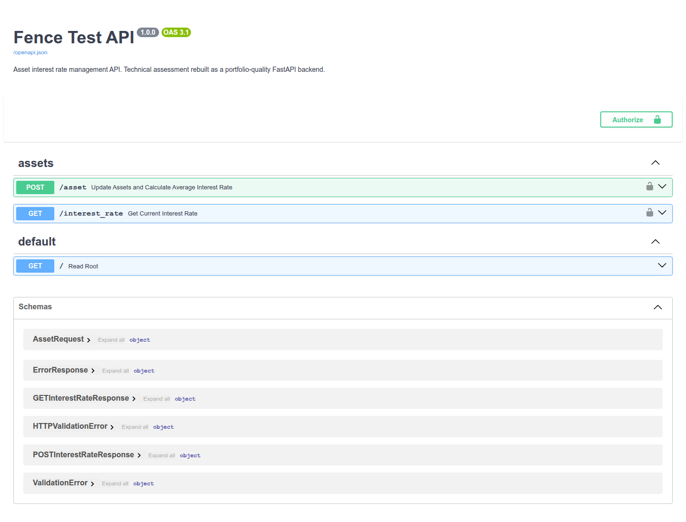
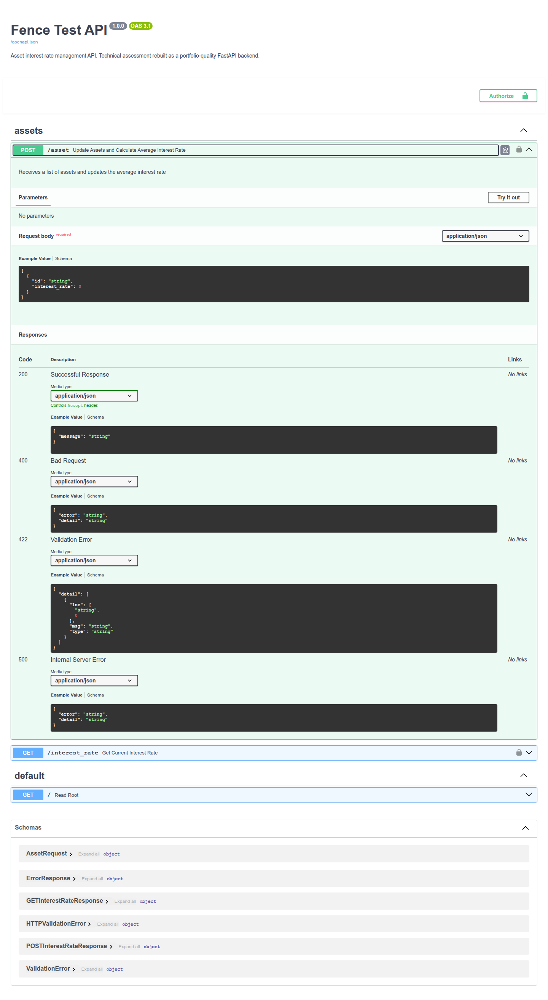
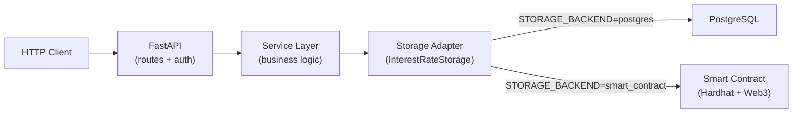

# Fence Test — Asset Interest Rate API

[](https://github.com/mpaya5/fence-test/actions/workflows/ci.yml)


---

## Recruiter / reviewer quick view

**This project demonstrates:**

- FastAPI backend architecture
- PostgreSQL + SQLAlchemy + Alembic
- Clean service / repository / storage separation
- Dockerized local environment
- API key authentication
- Pytest test suite and GitHub Actions CI
- Optional Solidity / Hardhat storage backend (switch via `STORAGE_BACKEND`)

> Take-home technical assessment rebuilt as a **portfolio-quality backend exercise**.  
> One codebase, two persistence backends — no branch switching required.

| | |
|---|---|
| **Run (PostgreSQL)** | `cp .env.example .env && docker compose --profile postgres up --build` |
| **Run (Smart contract)** | set `STORAGE_BACKEND=smart_contract` → `docker compose --profile smart_contract up --build` |
| **Tests** | `pip install -r requirements-dev.txt && make test` |
| **API docs** | http://localhost:8000/docs |

---

## Endpoints at a glance

| Method | Path | Auth | Description |
|:------:|------|:----:|-------------|
| `GET` | `/` | — | Health check + active storage backend |
| `POST` | `/asset` | `api_key` | Submit assets → compute & persist average interest rate |
| `GET` | `/interest_rate` | `api_key` | Return the latest stored average rate |
| `GET` | `/docs` | — | Swagger UI (OpenAPI) |
| `GET` | `/redoc` | — | ReDoc documentation |

Default API key: `your-secret-api-key-here` (override in `.env`)

### Try it in 30 seconds

```bash
# 1. Health check
curl http://localhost:8000/

# 2. Submit assets and save the average rate
curl -X POST "http://localhost:8000/asset" \
  -H "api_key: your-secret-api-key-here" \
  -H "Content-Type: application/json" \
  -d '[{"id": "id-1", "interest_rate": 100}, {"id": "id-2", "interest_rate": 10}]'

# 3. Read the stored rate
curl -H "api_key: your-secret-api-key-here" http://localhost:8000/interest_rate
```

**Sample responses:**

```json
// GET /
{"message": "Welcome to the Fence Test!", "storage_backend": "postgres"}

// POST /asset
{"message": "Average interest rate calculated and saved successfully"}

// GET /interest_rate
{"interest_rate": "55.0", "updated_at": "2025-10-15T18:22:51.768546"}
```

---

## Swagger / OpenAPI

Auto-generated at `/docs` when the API is running:





> Regenerate: start the API, then `python scripts/capture_swagger_screenshots.py` (requires `playwright`).

---

## Architecture



| Layer | Responsibility | Location |
|-------|----------------|----------|
| **API** | HTTP routing, auth, request/response validation | `app/api/` |
| **Service** | Average-rate calculation, orchestration | `app/services/` |
| **Storage** | Pluggable persistence (`InterestRateStorage`) | `app/storage/` |
| **PostgreSQL path** | Repository + SQLAlchemy + Alembic | `app/repositories/`, `app/database_handler/` |
| **Smart contract path** | Web3 client + Solidity contract | `app/smart_contracts/`, `contracts/` |

The service layer never imports SQLAlchemy or Web3 directly — swapping backends is a config change, not a refactor.

---

## Storage backend switch

Set in `.env`:

| Value | Backend | Docker profile |
|-------|---------|----------------|
| `postgres` *(default)* | PostgreSQL via SQLAlchemy | `--profile postgres` |
| `smart_contract` | Solidity contract on Hardhat | `--profile smart_contract` |

---

## Architecture decisions

| Decision | Choice | Why |
|----------|--------|-----|
| **Framework** | FastAPI | Async-ready, automatic OpenAPI docs, Pydantic validation out of the box |
| **Pluggable storage** | `InterestRateStorage` ABC + factory | Same API and service logic for DB and blockchain; demonstrates adapter pattern |
| **Persistence (default)** | PostgreSQL + SQLAlchemy 2.x | ACID compliance, realistic for production backends |
| **Persistence (alt.)** | Hardhat + Web3.py + Solidity | Meets the original smart-contract requirement without forking the repo |
| **Migrations** | Alembic | Version-controlled schema changes for the postgres path |
| **Layering** | Service + Storage adapter | Business logic independent of HTTP and infrastructure |
| **Auth (demo)** | API key header | Simple for an assessment; upgrade path to JWT/OAuth2 documented below |
| **Deployment** | Docker Compose profiles | Start only the infra each backend needs |
| **Testing** | pytest + SQLite in-memory | Fast CI without Docker; factory tests for both backends |
| **Linting** | Ruff | Single fast tool in CI |

---

## Why two backends?

The original exercise asked for a **Smart Contract** to store the interest rate, but noted a database is acceptable when the contract path is too costly.

| | **`postgres`** | **`smart_contract`** |
|---|----------------|----------------------|
| **Storage** | PostgreSQL | Solidity contract on Hardhat local chain |
| **Best for** | Production backends, ACID, complex queries | DeFi/Web3 integration demos |
| **Latency** | Milliseconds | Seconds (block confirmation) |
| **Ops complexity** | Postgres + migrations | Hardhat node + Web3 client + contract deploy |
| **Interview fit** | Primary backend portfolio piece | Shows breadth; same API, different adapter |

Both adapters share one service layer — the design decision I'd explain in an interview.

---

## Quick start

### Prerequisites

- Docker & Docker Compose
- Git

### PostgreSQL (default)

```bash
git clone https://github.com/mpaya5/fence-test.git
cd fence-test
cp .env.example .env
docker compose --profile postgres up --build
```

### Smart contract

```bash
cp .env.example .env
# Edit .env: STORAGE_BACKEND=smart_contract
docker compose --profile smart_contract up --build
```

---

## API reference — errors

| Status | Scenario | Response body |
|--------|----------|---------------|
| **403** | Missing API key | `{"detail": "No API key provided"}` |
| **403** | Wrong API key | `{"detail": "Invalid API key"}` |
| **404** | No rate stored yet | `{"detail": "No interest rate found. Please update assets first."}` |
| **422** | Validation error (e.g. negative rate) | Pydantic validation detail array |
| **500** | Unexpected server error | `{"detail": "Internal server error: ..."}` |

```bash
# 403 — no API key
curl -s http://localhost:8000/interest_rate

# 404 — before any POST /asset
curl -s -H "api_key: your-secret-api-key-here" http://localhost:8000/interest_rate
```

---

## Tests

```bash
python -m venv venv
source venv/bin/activate
pip install -r requirements-dev.txt
make test        # or: make lint
```

**13 tests** covering health check, POST/GET flows, auth (403), validation (422), service layer, and storage factory selection.

CI runs the same checks on every push to `main` (Ruff + pytest).

---

## Production improvements

What I would add before shipping to production:

1. **Authentication** — OAuth2/JWT instead of API-key header; secrets in a vault (AWS Secrets Manager, HashiCorp Vault).
2. **Async I/O** — `asyncpg` + async SQLAlchemy sessions for better concurrency.
3. **Connection pooling** — Tune `pool_size`, `pool_pre_ping`, and timeouts on the SQLAlchemy engine.
4. **Observability** — Structured JSON logging, OpenTelemetry traces, Prometheus metrics, `/health` + `/ready` probes.
5. **API hardening** — Rate limiting, request size limits, HTTPS, restricted CORS.
6. **CI/CD** — Docker image build, migration smoke tests against real Postgres, deploy to staging.
7. **Domain evolution** — Asset history table, idempotency keys on POST, pagination, event publishing (SQS/Kafka).

---

## Project layout

```
app/
├── api/v1/endpoints/       # Route handlers
├── core/                   # Config, security, logging
├── services/               # Business logic
├── storage/                # InterestRateStorage ABC + factory
├── repositories/           # PostgreSQL data access
├── database_handler/       # SQLAlchemy models, sessions, Alembic
├── smart_contracts/        # Web3 client + contract storage adapter
└── schemas/                # Pydantic DTOs
contracts/                  # Solidity source (Hardhat)
deploy/                     # Hardhat deploy scripts
docker/                     # Backend, migrations, Hardhat Dockerfiles
tests/                      # pytest suite
.github/workflows/          # CI (Ruff + pytest)
```

---

## License

MIT — use it as a reference, fork it, or ask me about the decisions in an interview.
