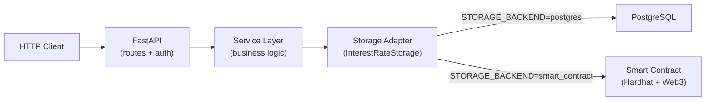

# Fence Test — Asset Interest Rate API

[](https://github.com/mpaya5/fence-test/actions/workflows/ci.yml)


> **FastAPI technical assessment rebuilt as a portfolio-quality backend exercise.**
>
> One codebase, two storage backends — switch with a single environment variable.

This repository started as a take-home technical exercise (see [`INSTRUCTIONS.md`](INSTRUCTIONS.md)). I rebuilt it into a production-minded backend sample: layered architecture, pluggable storage, PostgreSQL/SQLAlchemy + Alembic, an optional Hardhat/Solidity path, Docker, automated tests, and CI.

**Both implementations live in `main`.** Set `STORAGE_BACKEND` in `.env` to choose where interest rates are persisted — no branch switching required.

---

## Architecture



| Layer | Responsibility | Location |
|-------|----------------|----------|
| **API** | HTTP routing, auth, request/response validation | `app/api/` |
| **Service** | Average-rate calculation, orchestration | `app/services/` |
| **Storage** | Pluggable persistence (`InterestRateStorage`) | `app/storage/` |
| **PostgreSQL path** | Repository + SQLAlchemy + Alembic | `app/repositories/`, `app/database_handler/` |
| **Smart contract path** | Web3 client + Solidity contract | `app/smart_contracts/`, `contracts/` |

The service layer never imports SQLAlchemy or Web3 directly — it depends on the `InterestRateStorage` interface. Swapping backends is a config change, not a refactor.

---

## Storage backend switch

Set in `.env`:

| Value | Backend | Docker profile |
|-------|---------|----------------|
| `postgres` *(default)* | PostgreSQL via SQLAlchemy | `--profile postgres` |
| `smart_contract` | Solidity contract on Hardhat | `--profile smart_contract` |

```bash
# PostgreSQL (default)
STORAGE_BACKEND=postgres
docker compose --profile postgres up --build

# Smart contract
STORAGE_BACKEND=smart_contract
docker compose --profile smart_contract up --build
```

The health check at `GET /` returns the active backend:

```json
{
  "message": "Welcome to the Fence Test!",
  "storage_backend": "postgres"
}
```

---

## Architecture decisions

| Decision | Choice | Why |
|----------|--------|-----|
| **Framework** | FastAPI | Async-ready, automatic OpenAPI docs, Pydantic validation out of the box |
| **Pluggable storage** | `InterestRateStorage` ABC + factory | Same API and service logic for DB and blockchain; demonstrates adapter pattern |
| **Persistence (default)** | PostgreSQL + SQLAlchemy 2.x | ACID compliance, realistic for production backends |
| **Persistence (alt.)** | Hardhat + Web3.py + Solidity | Meets the original smart-contract requirement without forking the repo |
| **Migrations** | Alembic | Version-controlled schema changes for the postgres path |
| **Layering** | Service + Storage adapter | Business logic independent of HTTP and infrastructure |
| **Auth (demo)** | API key header | Simple for an assessment; upgrade path to JWT/OAuth2 documented below |
| **Deployment** | Docker Compose profiles | Start only the infra each backend needs |
| **Testing** | pytest + SQLite in-memory | Fast CI without Docker; factory tests for both backends |
| **Linting** | Ruff | Single fast tool in CI |

---

## Why two backends?

The original exercise asked for a **Smart Contract** to store the interest rate, but noted a database is acceptable when the contract path is too costly.

| | **`postgres`** | **`smart_contract`** |
|---|----------------|----------------------|
| **Storage** | PostgreSQL | Solidity contract on Hardhat local chain |
| **Best for** | Production backends, ACID, complex queries | DeFi/Web3 integration demos |
| **Latency** | Milliseconds | Seconds (block confirmation) |
| **Ops complexity** | Postgres + migrations | Hardhat node + Web3 client + contract deploy |
| **Interview fit** | Primary backend portfolio piece | Shows breadth; same API, different adapter |

Rather than maintaining two branches, both adapters share one service layer — the design decision I'd explain in an interview.

---

## Quick start

### Prerequisites

- Docker & Docker Compose
- Git

### PostgreSQL (default)

```bash
git clone https://github.com/mpaya5/fence-test.git
cd fence-test
cp .env.example .env
# STORAGE_BACKEND=postgres  (already the default)
docker compose --profile postgres up --build
```

### Smart contract

```bash
cp .env.example .env
# Edit .env: STORAGE_BACKEND=smart_contract
docker compose --profile smart_contract up --build
```

| URL | Description |
|-----|-------------|
| http://localhost:8000/docs | Swagger UI |
| http://localhost:8000/redoc | ReDoc |
| http://localhost:8000/ | Health check (+ active storage backend) |

---

## API reference

### Endpoints

| Method | Path | Auth | Description |
|--------|------|------|-------------|
| `GET` | `/` | No | Health / welcome + active `storage_backend` |
| `GET` | `/docs` | No | Swagger UI (OpenAPI) |
| `GET` | `/redoc` | No | ReDoc documentation |
| `POST` | `/asset` | `api_key` header | Receive assets, compute average rate, persist |
| `GET` | `/interest_rate` | `api_key` header | Return latest stored average rate |

Default API key (override in `.env`): `your-secret-api-key-here`

---

### Example: success flow

**1. POST /asset** — submit assets and persist the average

```bash
curl -X POST "http://localhost:8000/asset" \
  -H "api_key: your-secret-api-key-here" \
  -H "Content-Type: application/json" \
  -d '[{"id": "id-1", "interest_rate": 100}, {"id": "id-2", "interest_rate": 10}]'
```

```json
{
  "message": "Average interest rate calculated and saved successfully"
}
```

**2. GET /interest_rate** — read the latest value

```bash
curl -X GET "http://localhost:8000/interest_rate" \
  -H "api_key: your-secret-api-key-here"
```

```json
{
  "interest_rate": "55.0",
  "updated_at": "2025-10-15T18:22:51.768546"
}
```

---

### Example: errors

| Status | Scenario | Response body |
|--------|----------|---------------|
| **403** | Missing API key | `{"detail": "No API key provided"}` |
| **403** | Wrong API key | `{"detail": "Invalid API key"}` |
| **404** | No rate stored yet | `{"detail": "No interest rate found. Please update assets first."}` |
| **422** | Validation error (e.g. negative rate) | `{"detail": [{"type": "greater_than_equal", "loc": ["body", 0, "interest_rate"], ...}]}` |
| **500** | Unexpected server error | `{"detail": "Internal server error: ..."}` |

```bash
# 403 — no API key
curl -s http://localhost:8000/interest_rate | jq

# 404 — before any POST /asset
curl -s -H "api_key: your-secret-api-key-here" http://localhost:8000/interest_rate | jq
```

---

## Swagger UI

Interactive docs are auto-generated at `/docs`:


> Regenerate screenshots after UI changes: start the API, then run `python scripts/capture_swagger_screenshots.py` (requires `playwright`).

---

## Tests

Tests use **pytest** with an in-memory SQLite database — no Docker required.

```bash
python -m venv venv
source venv/bin/activate
pip install -r requirements-dev.txt
make test
```

Or directly: `PYTEST_DISABLE_PLUGIN_AUTOLOAD=1 pytest -v`

Coverage includes:

- Health check (including active storage backend)
- POST `/asset` average calculation and persistence
- GET `/interest_rate` happy path and 404
- API key authentication (403)
- Pydantic validation (422)
- Service-layer unit tests
- Storage factory (postgres vs smart_contract selection)

---

## What I would improve in production

1. **Authentication** — Replace API-key header with OAuth2/JWT, rotate secrets via a vault (AWS Secrets Manager, HashiCorp Vault).
2. **Async I/O** — Move to `asyncpg` + async SQLAlchemy sessions for better concurrency under load.
3. **Connection pooling** — Tune pool size, `pool_pre_ping`, and timeouts on the SQLAlchemy engine.
4. **Observability** — Structured logging (JSON), OpenTelemetry traces, Prometheus metrics, health/readiness probes.
5. **API hardening** — Rate limiting, request size limits, HTTPS termination, CORS restricted to known origins.
6. **CI/CD** — Extend the current Ruff + pytest pipeline with Docker image build, migration smoke tests against real Postgres, and deployment to staging.
7. **Domain evolution** — Asset history table, idempotency keys on POST, pagination on historical rates, event publishing (SQS/Kafka) for downstream consumers.

---

## Project layout

```
app/
├── api/v1/endpoints/       # Route handlers
├── core/                   # Config, security, logging
├── services/               # Business logic
├── storage/                # InterestRateStorage ABC + factory
├── repositories/           # PostgreSQL data access
├── database_handler/       # SQLAlchemy models, sessions, Alembic
├── smart_contracts/        # Web3 client + contract storage adapter
└── schemas/                # Pydantic DTOs
contracts/                  # Solidity source (Hardhat)
deploy/                     # Hardhat deploy scripts
docker/                     # Backend, migrations, Hardhat Dockerfiles
tests/                      # pytest suite
.github/workflows/          # CI (Ruff + pytest)
```

---

## License

MIT — use it as a reference, fork it, or ask me about the decisions in an interview.
